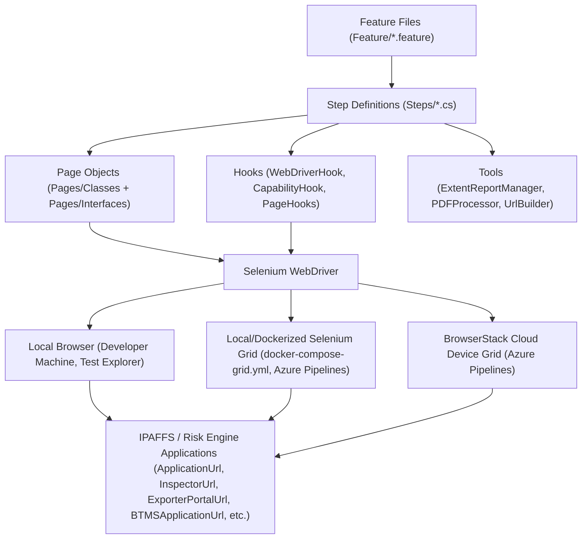

# Defra.UI.Tests

## Overview
`Defra.UI.Tests` is the core UI automation test project for the **IPAFFS Test Team**, covering the **IPAFFS** and **Risk Engine** applications. It contains **Reqnroll** (Gherkin/BDD) feature files, step definitions, page objects, and supporting tools used to validate CHED (Common Health Entry Document) notification and risk engine workflows — including CHEDA, CHEDD, CHEDP, and CHEDPP — via a page-object driven Selenium WebDriver framework. Tests run against a **Dockerized Selenium Grid by default** (see `docker-compose-grid.yml`), with optional execution against **BrowserStack's** cloud device grid for cross-browser/cross-device coverage.


## Features
- **BDD scenarios** written in Gherkin (`Feature/*.feature`) covering notification creation and risk engine flows for CHEDA, CHEDD, CHEDP, and CHEDPP document types.
- **Reqnroll + NUnit** as the test execution framework (see `reqnroll.json`, NUnit test adapter references).
- **Page Object Model** — `Pages/Classes` (implementations) and `Pages/Interfaces` (contracts) provide a maintainable abstraction over the application UI.
- **Step definitions** (`Steps/*.cs`) bind Gherkin steps to page object actions.
- **Hooks** (`Hooks/WebDriverHook.cs`, `CapabilityHook.cs`, `PageHooks.cs`, `StepsHelper.cs`) manage driver lifecycle, browser capabilities, and per-scenario setup/teardown.
- **Browser capability configuration** for Chrome, Edge, Firefox, and BrowserStack (`Capabilities/*.cs`).
- **Configurable runtime settings** via `appsettings.json` and multiple `testrun*.runsettings` files for different execution profiles.
- **PDF processing tools** (`Tools/PDFProcessor`) for extracting and validating CHED PDF/CSV data.
- **Test data** for users, documents, and bulk-upload commodity rules (`Data/Users`, `Data/Documents`, `Data/Rules`).
- **Extent report generation** (`Tools/ExtentReportManager.cs`) for rich HTML test reports.
- **Docker-based Selenium Grid** support via `docker-compose-grid.yml` for local grid execution.

## Architecture


## Prerequisites
- **Visual Studio 2026** (or later) with .NET desktop development workload.
- **.NET 8 SDK**.
- **Reqnroll** Visual Studio extension (for `.feature` file syntax highlighting/navigation).
- Access credentials for the target IPAFFS environment(s) (see `Data/Users`).

## Installation
1. Clone the repository and open the solution in Visual Studio:
   ```
   git clone https://github.com/DEFRA/ipaff-ops-automation-tests.git
   ```
2. Open `Defra.IPAFF.AutomationTests.sln`.
3. Restore NuGet packages (automatic on open, or run `dotnet restore`).
4. Build the solution (`Ctrl+Shift+B`) or `dotnet build`.

## Running Tests

### Option A: Locally via Test Explorer
1. Open `Defra.UI.Tests\appsettings.json` and update the runtime parameters (target environment URL, credentials, headless mode, browser/device target, BrowserStack keys if applicable).
   > ⚠️ Never commit real credentials/secrets. Use local, non-committed overrides where possible.
2. Build the solution to discover tests (`Ctrl+Shift+B`).
3. Open **Test > Test Explorer** (`Ctrl+E, T`).
4. Filter tests by feature/category (e.g., by CHEDPP or CHEDA) and click **Run** or **Run Selected Tests**.
5. Review results in Test Explorer; HTML reports are generated via `ExtentReportManager` in the test output directory.

### Option B: Via Azure Pipelines
Pipeline definitions live under the [`CI`](../CI) folder:

- **`CI/build-pipeline.yml`** — triggered on `master`, `dev`, `feature/*`, `task/*`, and `release/*` branches. Restores, publishes, and zips `Defra.UI.Tests.csproj` (using `Defra.UI.Tests/NuGet.Config`), then publishes the output as a `drop` build artifact consumed by both regression pipelines below.
- **`CI/run-test-template.yml`** — shared job template invoked by both regression pipelines for each stage; downloads the build artifact, extracts it, and runs the test suite against the selected environment/browser/device configuration.
- **`CI/variables/IPAFF/*.yml`** — per-environment (e.g. `pre`) and `global.yml` variable definitions (environment URL, Selenium Grid/BrowserStack settings, worker count, PIMS/IDCOMS credentials sourced from the `IPAFFPREPROD` variable group).

There are two manually-triggered (`trigger: none`, `pr: none`), parameterized **regression** test pipelines, both sharing the same parameter set (`environment`, `workers`, `seleniumGrid`, `deviceName`, `bsOSVersion`, `bsBrowserVersion`, `target`, `isEmulationEnabled`, `emulateDeviceInfo`, `isAccessibilityEnabled`, `enableRetry`, `featureFilter`):

1. **IPAFFS_Regression** — `CI/ipaffs-test-execution.yml`. Downloads the latest `drop` artifact and executes tests per CHED stage (CHEDA, CHEDD, CHEDP, CHEDPP) as sequential stages, or a single custom stage filtered by tag/feature (`featureFilter` parameter, e.g. `SPS-9104` or `CHEDA`).
2. **RiskEngine_Regression** — `CI/risk-engine-test-execution.yml`. Downloads the latest `drop` artifact and executes Risk Engine stages (Bulk Upload, then CHEDA/CHEDD/CHEDP/CHEDPP Risk Engine scenarios) as sequential stages, or a single custom stage filtered by tag/feature (`featureFilter` parameter, e.g. `SPS-9414` or `RiskEngine-CHEDPP`).

To run tests via Azure Pipelines:
1. Ensure `CI/build-pipeline.yml` has produced a `drop` artifact for the branch you want to test (runs automatically on push to `dev`/`master`/`feature/*`/`task/*`/`release/*`).
2. Queue either **`ipaffs-test-execution.yml`** (IPAFFS_Regression) or **`risk-engine-test-execution.yml`** (RiskEngine_Regression) manually from **Azure DevOps > Pipelines**, selecting parameters such as `environment` (e.g. `pre`), `target` browser, `seleniumGrid` URL (local grid or BrowserStack), `deviceName`/`bsOSVersion` for BrowserStack, `workers`, and `featureFilter` (`all` to run every stage, or a specific tag/feature).
3. Credentials and environment configuration are supplied via the `IPAFFPREPROD` variable group and `CI/variables/IPAFF/*.yml` templates rather than local `appsettings.json` values — no secrets are stored in the repo.
4. Each stage (or the custom stage) runs as a separate job; review results and Extent HTML reports as published test artifacts in the Azure DevOps run summary.

## Project Structure
```
Defra.UI.Tests/
├── Feature/            # Gherkin .feature files (CreateNotifications-*, RiskEngine-*)
├── Steps/              # Step definitions bound to feature files
├── Pages/
│   ├── Classes/         # Page object implementations
│   └── Interfaces/      # Page object interfaces
├── Hooks/               # Before/After hooks (driver lifecycle, capabilities, page setup)
├── Capabilities/        # Browser/BrowserStack capability configuration
├── Configuration/       # Runtime configuration classes (TestConfiguration, BrowserStackConfiguration, etc.)
├── Contracts/           # Shared DTOs (LoginDetails, NotificationDetails, Summary)
├── Data/
│   ├── Users/           # Environment-specific user credentials
│   ├── Documents/       # Sample documents used in upload scenarios
│   └── Rules/           # Bulk-upload commodity rule CSV files
├── HelperMethods/       # Data helpers, email/key vault utilities
├── Tools/               # ExtentReportManager, UrlBuilder, PDFProcessor, Waits, Utils
├── appsettings.json     # Runtime configuration
├── reqnroll.json        # Reqnroll configuration
├── testrun*.runsettings # Test run configuration profiles
└── docker-compose-grid.yml  # Local Selenium Grid setup

CI/                        # Azure Pipelines definitions (solution root)
├── build-pipeline.yml               # Build/publish/artifact pipeline (dev, master, feature/*, task/*, release/*)
├── ipaffs-test-execution.yml        # IPAFFS regression pipeline (per CHED stage or custom filter)
├── risk-engine-test-execution.yml   # Risk Engine regression pipeline (Bulk Upload + per CHED Risk Engine stage, or custom filter)
├── run-test-template.yml            # Shared job template for downloading artifacts and running tests
└── variables/IPAFF/                 # Per-environment and global variable definitions (global.yml, pre.yml, etc.)
```

## Contributing
1. Create a feature branch from `dev`: `git checkout -b feature/<short-description>`.
2. Write/update `.feature` files and corresponding step definitions — keep scenarios declarative and business-readable.
3. Follow the existing Page Object Model pattern: add an interface under `Pages/Interfaces` and its implementation under `Pages/Classes` for new pages.
4. Ensure new/changed tests pass locally via Test Explorer before pushing.
5. Do not commit real credentials or secrets — use placeholders in `appsettings.json` and rely on pipeline variables for CI.
6. Open a pull request against `dev`, describing the scenarios covered and any configuration changes required.
7. Ensure the Azure Pipeline run passes before requesting review/merge.
